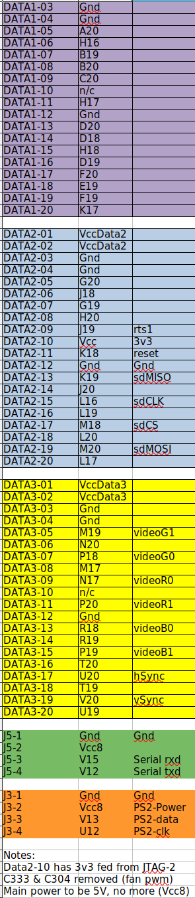

# EBAZ4205 version of multicomp

33MHz fed into N18 of PL from PS clock
PLL divisor adjusted accordingley
I/O remapped to EBAZ4205 data connetcors

## load bitstream from sd-card with u-boot

```
Hit any key to stop autoboot:  0 
Zynq> set loadbit_addr 0x100000
Zynq> set bitstream_image multicomp_wrapper.bit
Zynq> load mmc 0 ${loadbit_addr} ${bitstream_image}
2083853 bytes read in 135 ms (14.7 MiB/s)
Zynq> fpga loadb 0 ${loadbit_addr} ${filesize}
  design filename = "multicomp_wrapper;UserID=0XFFFFFFFF;Version=2020.2"
  part number = "7z010clg400"
  date = "2021/01/16"
  time = "23:30:32"
  bytes in bitstream = 2083740
zynq_align_dma_buffer: Align buffer at 100071 to fff80(swap 1)
INFO:post config was not run, please run manually if needed
Zynq> 
```

Multicomp is then active in two consoles, VGA and Serial
```
Press [SPACE] to activate console

CP/M Boot ROM 2.0 by G. Searle
BC or BW - ROM BASIC Cold/Warm
X        - Boot CP/M (load $D000-$FFFF)
:nnnn... - Load Intel-Hex file record
Gnnnn    - Run loc nnnn
>
```

## save bitstream into nand flash from u-boot prompt

Instead of loading a bitstream from sd-card or tftp, jtag, etc it can be saved into an unused area of nand flash for loading later during the boot process. 

The command below were issued from the u-boot interrupted during boot from nand or in this case whilst booting from sd-card. 

```
set loadbit_addr 0x100000
set bitstream_image multicomp_wrapper.bit
load mmc 0 ${loadbit_addr} ${bitstream_image}
echo ${filesize}
set nand_offset 0x7000000
nand device 0
nand erase ${nand_offset} ${filesize}
nand write ${loadbit_addr} ${nand_offset} ${filesize}
```

## load bitstream from nand flash at boot time

Note: filesize must be at least the size of the saved bitstream, us avtual size 0x1fcc0d or 0x200000

```
set nand_offset 0x7000000
set loadbit_addr 0x100000
set filesize 0x1fcc0d
nand read ${loadbit_addr} ${nand_offset} ${filesize}
fpga loadb 0 ${loadbit_addr} ${filesize}
```

## automatically load new bitstream at boot time

To fully automate the use of a new buitstream the boot setting need to be changed, one simple way to do this is by adding an override to the u-boot enviorenment to be loaded at boot time in the file boot.scr which is loaded if it exists when u-boot executes.

boot.scr is a compiled version of boot.cmd. it can have the commands in it to load the bitstream from nand similar to whet is shown above, and then compiled with the command below:

```
set loadbit_addr 0x100000
set bitstream_image multicomp_wrapper.bit
load mmc 0 ${loadbit_addr} ${bitstream_image}
fpga loadb 0 ${loadbit_addr} ${filesize}
```

```
mkimage -c none -A arm -T script -d boot.cmd boot.scr
```




# Zed-Multicomp
Zedboard implementation of multicomp. The zedboard has enough block ram to support the full 64k using internal ram. The ram code and memory map has been amended accordingly. Some of the memory and clocking routines are based on work by Michael Jørgensen.

# Hardware
Diglient Zedboard: https://store.digilentinc.com/zedboard-zynq-7000-arm-fpga-soc-development-board/ <br>
Requires a ps2 pmod in JA: https://reference.digilentinc.com/reference/pmod/pmodps2/start<br>
Optional SD Card pmod in JD: https://store.digilentinc.com/pmod-sd-full-sized-sd-card-slot/<br>

Button C (centre button) is the reset button.

# Building in Vivado 2019.2
You can switch between builds either by loading the pre-build bitstreams on the releases page or by modifying the Vivado project. Instructions are here: http://searle.x10host.com/Multicomp/index.html

Roms are loaded in the Microcomputer.vhd file. Specify the location of the rom on your PC.
<ul>
<li>Zedboard 6502 rom is located in https://github.com/mattuna15/zed-multicomp/blob/master/ROMS/6502/basic_rom.hex
<li>Zedboard 6809 rom is located in https://github.com/mattuna15/zed-multicomp/blob/master/ROMS/6809/basic_6809.hex
<li>Zedboard Z80 CPM rom is located here https://github.com/mattuna15/zed-multicomp/blob/master/ROMS/Z80/z80-CPM-basic.hex
</ul>

The original intel-altera .hex files can be converted using Srecord or use my files. http://srecord.sourceforge.net/

Specify intel for input format and ascii-hex as output. Load resulting file into notepad++, remove header and trailer, replace spaces between values for "\n". The resulting file then needs to be loaded into the rom file.

NB 
<ul>
<li>You have full access to all RAM - max 56K
<li>CPM build requires extra changes http://searle.x10host.com/Multicomp/cpm/fpgaCPM.html<br>
  CPM requires SD/SDHC card with CPM SD card image in pmod JD.<br>
Demo Image available from https://obsolescence.wixsite.com/obsolescence/multicomp-fpga-cpm-demo-disk
</ul>

<hr>
Project acknowledgments: <br>

http://searle.x10host.com/Multicomp/index.html<br>
https://www.retrobrewcomputers.org/doku.php?id=boards:sbc:multicomp:papilio-duo:start<br>
https://github.com/MJoergen/dyoc <br>

License:

“By downloading these files you must agree to the following: The original copyright owners of ROM contents are respectfully acknowledged. Use of the contents of any file within your own projects is permitted freely, but any publishing of material containing whole or part of any file distributed here, or derived from the work that I have done here will contain an acknowledgement back to myself, Grant Searle, and a link back to this page. Any file published or distributed that contains all or part of any file from this page must be made available free of charge.” - http://searle.x10host.com/Multicomp/index.html


